# HiSeqGAN : Hierarchical Sequence Synthesis and Prediction
- Author : Yun-Chieh Tien (106356004@nccu.edu.tw), Chen-Min Hsu (107356019@nccu.edu.tw),  I-Li Chen (109356049@nccu.edu.tw) and Fang Yu (yuf@nccu.edu.tw)

## Abstract
High-dimensional data sequences constantly appear in practice. State-of-the-art models such as recurrent neural networks suffer prediction accuracy from complex relations among values of attributes. Adopting unsupervised clustering that clusters data based on their attribute value similarity results in data in lower dimensions that can be structured in a hierarchical relation. It is essential to consider these data relations to improve the performance of training models. In this work, we propose a new approach to synthesize and predict sequences of data that are structured in a hierarchy.

<center>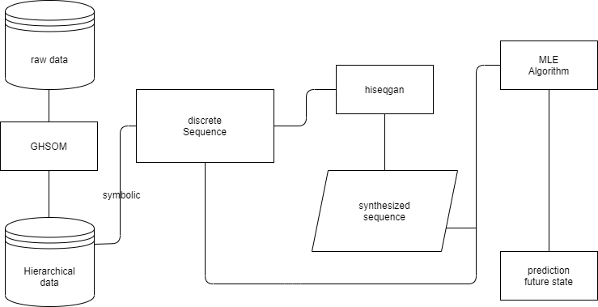</center>

### Prospects
- Supply chain demand forecasting
- Predict final grades base on students' learning situation
- Use credit rating data to predict whether customers will bounce

### Contributions
- Input generation: provide more data to train a  model such as RNN
- Sequence prediction: achieve higher accuracy for predicting high dimensional data sequence

<!--- The insertion of these two parts doesn't make sense now, the whole 'Abstract' paragraph would need a thorough overhaul --->

### GHSOM & Hierarchical data encoding
GHSOM is a self-organizing map that grows hierarchically based on data distribution. The GHSOM map results in data in clusters of a tree-like structure. Use decimal encoding to label the clusters. After using the decimal number to label clusters, we converse each number to the two-dimensional coordinate vector.

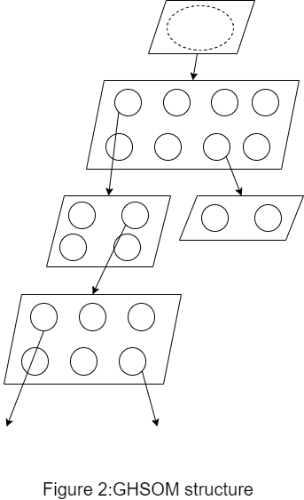

### HiSeqGAN
HiSeqGAN uses the real-world data and the native samples generated by the generator to train the discriminator so that the discriminator can distinguish real-world data from fake samples. Then, the reward is passed back to the intermediate state-action steps by using the Monte Carlo search. Second, the generator updates by reinforcement learning. 

<center>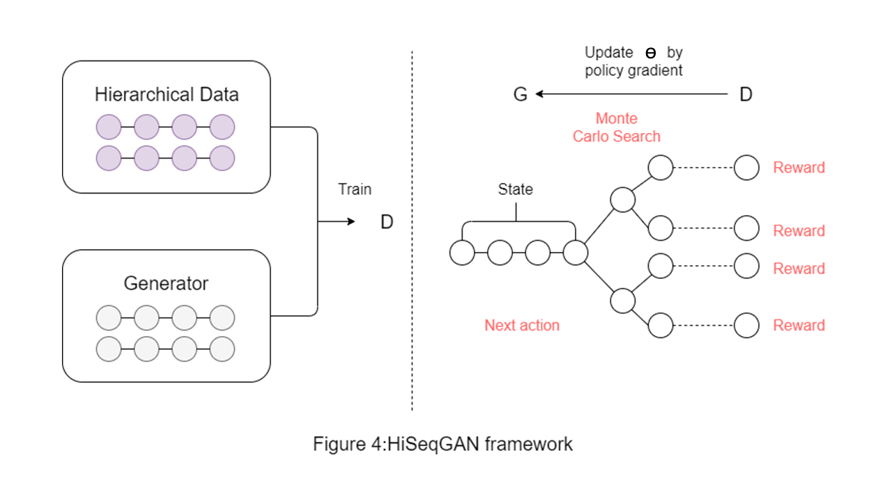</center>

### Sequence Similarity
To evaluate the prediction on clusters between two labels, we propose three-dimensional cosine similarity on their coordinates. The reason that we extend two-dimensional to three-dimensional is to prevent the distortion of the original point on the same plane.

<!--- There should be a distinct indication between these two parts --->

## Experiments

### Prerequisites
Please download this repository and put the data in the `./raw/data` folder. 

### Environment
- Python: 3.8.5
- TensorFlow: 2.4.0
- GPU: NVIDIA GeForce GTX 1080

In the experiment, we are divided into five parts
- _Data Preprocessing_
  - Use GHSOM to transform data from high-dimensional data into hierarchical data
  - Generate the cluster sequence base on item
- _Use HiSeqGAN to generate sequence data and perform sequence synthesis_
- _Use RNN to compare the accuracy of the original data with the sequence synthesis data in sequence prediction_
- _Compare the accuracy of Naive Bayes, RNN, HiSeqGAN for time series data prediction_
- _From cluster prediction to actual value prediction_

## Step 1 : Abstraction: Abstracting High Dimensional Data with Symbolic Labels using unsupervised clustering GHSOM

- Execute the following command to transform data from high-dimensional data into hierarchical data, and label each cluster according to its position in each layer. Then generate cluster sequence base on `$index` and `$date_column`.
  - __tau1__ : Which represents the same-layer SOM map similarity.
  - __tau2__ : The depth of the GHSOM structure.
  - __data__ : Set the data name which map the ***.csv*** file in raw-data folder.
  - __index__ : Set the field as the index for clustering.
  - __target__ : Set the field as the index for clustering.
  - __date_column__ : Fields sorted by time, which use this column to generate a cluster sequence.
  - __train_column__ : Field to be clustering.
```bash
python execute.py --tau1=0.1 --tau2=0.01 --data=wm5-normalize --index=id --target=id --date_column=week --train_column=TA_video,TA_text,Teacher_video,Teacher_text
```

### Construct the Abstract Domain: Use GHSOM to cluster data that have similar attribute values

<center>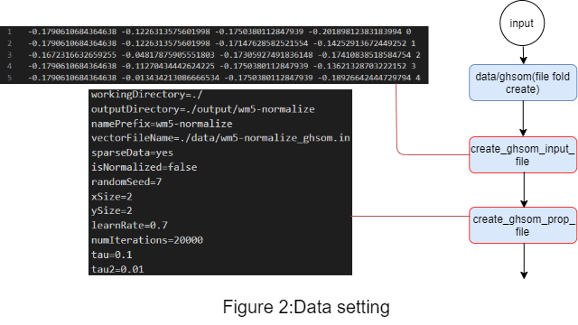</center>

Here we use the [GHSOM](http://www.ifs.tuwien.ac.at/~andi/ghsom/) program provided by Vienna University of Technology. 

First, when you have executed the above instructions, you will generate data in the `applications/$data/` folder.(ex.applications/wm5_normalize)

- Before converting high-dimensional data into hierarchical data, please convert the data into a specific format (.in file). ex. [wm5-normalize_ghsom.in](./program/GHSOM/data/wm5-normalize_ghsom.in) 

- The .in file format is as follows (create_ghsom_input_file) :
    ```bash
    $TYPE inputvec
    $XDIM 2592
    $YDIM 1
    $VECDIM 4

    -0.1790610684364638 -0.1226313575601998 -0.1750380112847939 -0.20189812383183994 0
    -0.1790610684364638 -0.1226313575601998 -0.17147628582521554 -0.14252913672449252 1
    -0.1672316632659255 -0.04817875905551803 -0.17305927491836148 -0.17410838518584754 2
    -0.1790610684364638 -0.11270434442624225 -0.1750380112847939 -0.13621328703222152 3
    -0.1790610684364638 -0.013434213086666534 -0.1750380112847939 -0.18926642444729794 4
    -0.16469679072938154 -0.1226313575601998 -0.17187203309850205 -0.03958078674047519 5
    -0.1790610684364638 -0.06182840211470969 -0.1750380112847939 -0.17221363027816625 6
    -0.1790610684364638 -0.1226313575601998 -0.1750380112847939 -0.17284521524739332 7
    -0.1790610684364638 -0.0568648955477309 -0.1750380112847939 -0.17726631003198304 8
    -0.1790610684364638 -0.08044155174088014 -0.1750380112847939 -0.17095046033971206 9
    -0.1790610684364638 -0.07175541524866726 -0.1750380112847939 -0.17473997015507464 10
    ....
    ```
  > Reference from : http://www.ifs.tuwien.ac.at/~andi/somlib/download/SOMLib_Datafiles.html#input_vectors
  
- Then GHSOM property file is generated as follows (create_ghsom_prop_file): 
    ```bash
    workingDirectory=./
    outputDirectory=./output/wm5-normalize
    namePrefix=wm5-normalize
    vectorFileName=./data/wm5-normalize_ghsom.in
    sparseData=yes
    isNormalized=false
    randomSeed=7
    xSize=2
    ySize=2
    learnRate=0.7
    numIterations=20000
    tau=0.1
    tau2=0.01
    ```
  > Reference from : http://www.ifs.tuwien.ac.at/dm/somtoolbox/examples/PROPERTIES
  
- When GHSOM finished clustering, it will generate the output in `applications/$data/GHSOM/output/$data` folder. It contains  `.html`, `.map`, `.unit`, `.wgt`. 
  - The `.unit` file describes the units of the trained Self-Organizing Map. It is written by the SOM training program.<br>
    - The files consist of two blocks, the first one describing the general SOM structure, the second giving a specific description of every unit.
    - The first 3 parameter entries are given as a sanity check to find out whether the given SOM map file and weight vector file match. If any of the 3 first parameters does not match the program should print a detailed error message and exit.
  > Reference from http://www.ifs.tuwien.ac.at/~andi/somlib/download/SOMLib_Datafiles.html
  
### Relabel original data with symbolic labels 
<center></center>
In the second part, we will start to run GHSOM. First, GHSOM would generate a cluster for each week in each student id(ex.extract_ghsom_output's picture) and then make a cluster with a label(ex.with_cluster_label.csv).
第二部分開始執行ghsom，會先產生ghsom分群(ex.extract_ghsom_output的圖)，接著希望每個分群加上標籤，
而產生了with_cluster_label.csv這個檔案。

<center>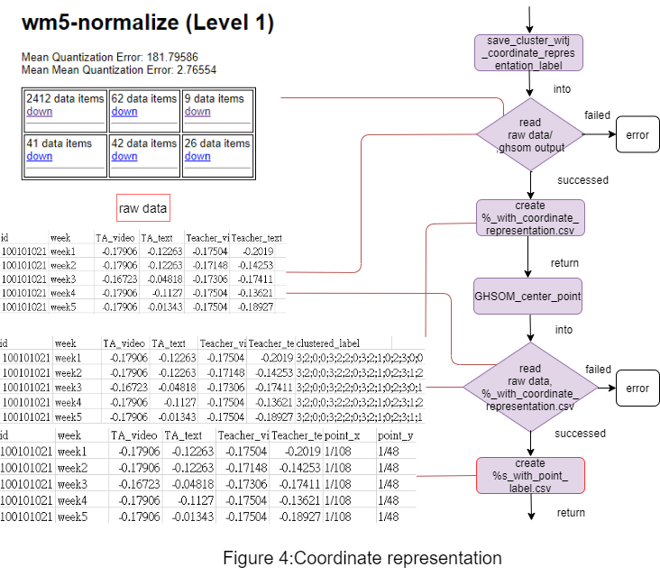</center>
After making each cluster with a label, we need to generate a cluster a coordinate representation intends to calculate the loss function.
分完群也上過標籤後，第三部分再給予每個分群座標位置，最終每筆資料將產生屬於自己的xy座標(相同座標代表相同集群)
，目的是為了之後算loss function。

<center>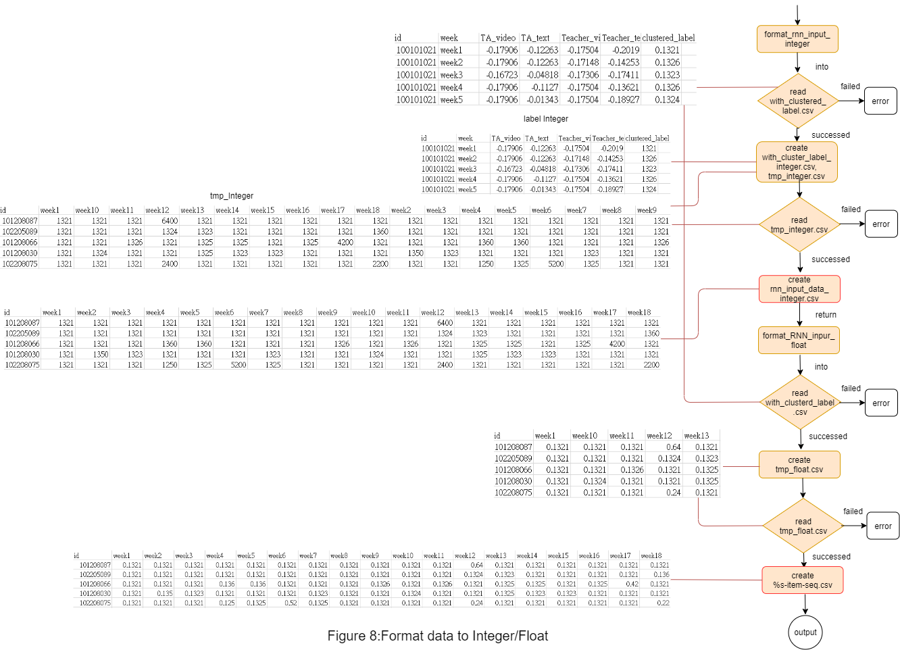</center>
In the fourth part, we want to have  Integer labels but the label we generate in the second part is  Float labels. Therefore , we use ''format_rnn_input_integer'' this function to format our labels and use "format_rnn_input_float"create "item-seq.csv" data which is needed in the next part.
最後第四階段剛開始使用第二階段產生的with_cluster_label.csv，因為原本此檔案的標籤是浮點數形式，
但我們希望其表現方式為整數，因此透過format_rnn_input_integer這個方法轉換成我想要看到的整數標籤而得到了
rnn_input_data_integer.csv這個檔案。另外產生item-seq.csv是為了接下來的第五部分需要把每位id分群成一個標籤而準備的資料。

### Generate for each student a symbolic label that represents their weekly records over the semester

- Given the GHSOM map, each weekly data can then be represented as a label that encodes their cluster. We can then generate for each student a cluster sequence that represents their weekly records over the semester. The cluster sequence is based on the fields given by `$index` and `$date_column`.
```csv
id,week1,week2,week3,week4,week5,week6,week7,week8,week9,week10,week11,week12,week13,week14,week15,week16,week17,week18
102205089,5521,5521,5521,5521,5521,5521,5521,5521,5521,5521,5521,5524,5521,5521,5521,5521,5521,5560
```

```bash
python ghsom-item-seq.py --data=wm5-normalize --index=id --train_column=week1,week2,week3,week4,week5,week6,week7,week8,week9,week10,week11,week12,week13,week14,week15,week16,week17,week18
```

<center>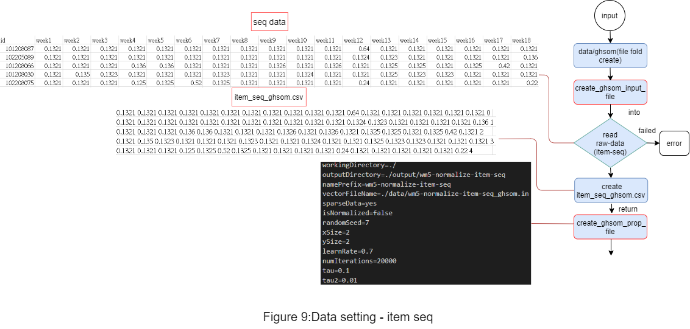</center>
Because our raw data have a lot of weekly columns we use GHSOM to reduct weekly columns' dimensions to the label(ex.rnn_input_data_integer.csv). However, our goal is "each student " has a cluster label. Thus, in the fifth part, we need to achieve this goal. First, we create a new folder to store our data for step2 and then read item-seq data to generate GHSOM's input file和prop file.
因為原始資料欄位多，前面的ghsom是先把多維資料降維成一個標籤，得到了「每個id的每週資料皆
有一個標籤代表其資料屬性(rnn_input_data_integer.csv)」，然而最終目的是希望將「每個id的全部資料」降維成一個標籤，
因此第五部分再次將「每個id的每週資料皆有一個標籤代表其資料屬性」的資料用ghsom分群成
「每個id皆有一個標籤」代表其整體屬性。
要使每個id皆有一個標籤的第一步，一樣是先建立資料夾，跟前面不同的是這邊讀取的是item-seq data，然後開始
產生GHSOM的input file和prop file。

<center>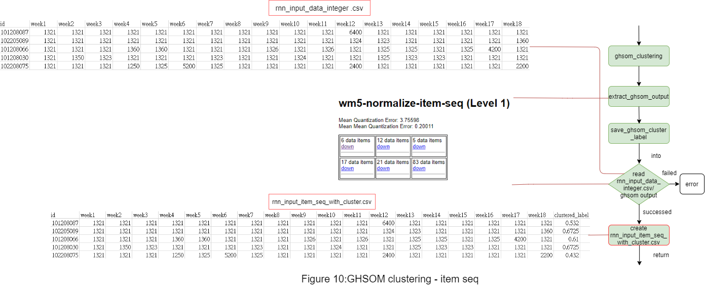</center>
In the second part, it also starts to generate GHSOM clusters(ex.extract_ghsom_output),and give each student a cluster label(ex.rnn_input_item_seq_with_cluster.csv).
第二部分開始執行ghsom，一樣會先產生ghsom分群(ex.extract_ghsom_output的圖)，接著希望每個id擁有一個標籤，
而產生了rnn_input_item_seq_with_cluster.csv這個檔案。

<center>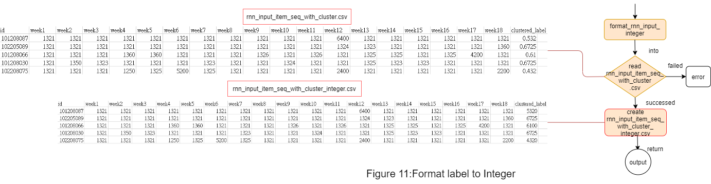</center>
In the last part, we want to have Integer labels but the label we generate in the second part is Float labels. Therefore , we use ''format_rnn_input_integer'' this function to format our labels(rnn_input_item_seq_with_cluster_integer.csv). 
最後第三階段使用第二階段產生的rnn_input_item_seq_with_cluster.csv，因為原本此檔案的標籤是浮點數形式，
但我們希望其表現方式為整數，因此透過format_rnn_input_integer這個方法轉換成我想要看到的整數標籤而得到了
rnn_input_item_seq_with_cluster_integer.csv這個檔案。到這邊完成Step 1。


## Step 2 : Sequence Synthesis: Use HiSeqGAN to generate cluster sequence
First, we use SeqGAN to generate data $`Data{_{HiSeqGAN}}`$. There are 144 original data, so here we use SeqGAN to generate 856 time series data.
After SeqGAN has generated the data, STEP3 we will add them to original data to verify adding SeqGAN data can improve the accuracy of time series prediction of RNN.

- Execute the following command to generate a sequence for sequence synthesis.
  - __data__ : Set the data name which map the ***.csv*** file in raw-data folder.
  - __index__ : Set the field as the index for clustering.
  - __target__ : Set the field as the index for clustering.
  - __generated_num__ : The number that how many sequences are generated.
  - __total_batch__ : Number of times the entire dataset was trained.
  - __batch_size__ : The batch size will determine the number of samples we train at a time.
```bash
python execute-rnn.py --data=wm5-normalize --target=id --generated_num=856 --total_batch=100 --batch_size=5 --seq_length=18
```

<center>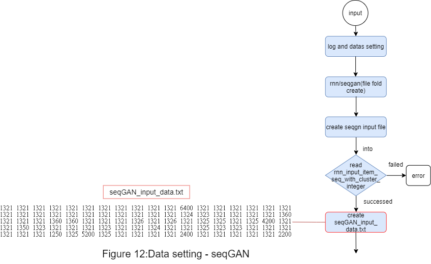</center>
First, it would generate a log file, data settings, and create folders to store data generated by step2. Next, read "rnn_input_item_seq_with_cluster.csv" and generate a seqGAN input file.
STEP2開始，首先先建立log紀錄文件和資料相關設定，還有一樣建立step2執行過程中存放資料的資料夾。接著讀取前面step1
最後產生的每個id有一個標籤的csv檔，產生segqan 需要的的input資料。

<center></center>
Second, we will start to execute seqGAN, the generator would generate a sequence similar to raw sequence data, and the discriminator will evaluate those sequences. If the sequence is not similar to raw sequences it will recreate a new one unstill the discriminator is satisfied.
第二部分開始執行seqgan，generator會先生出一組序列，讓已看過真實資料的discriminator評斷generator
產的資料的真假，如果看起來不真generator就需要重新產生序列，直到discriminator滿意為止。
我們的目標為將144筆的原始資料，希望產生856筆資料，使整體資料共有1000筆，將拿來用在之後第三階段使用rnn來評估產生的序列的品質。

<center>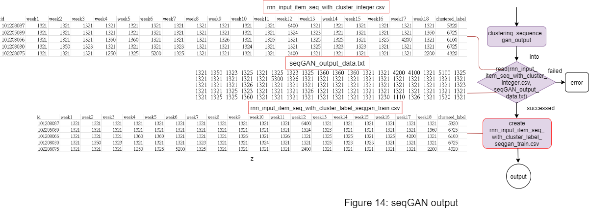</center>
After executing seqGAN, it makes raw data and data generated by HiseqGAN combine to a new data(ex.rnn_input_item_seq_with_cluster_label_seqgan_train.csv). The data will be used in the next step to evaluate the quality of the sequence synthesized by HiSeqGAN. 
第三部分就是seqgan執行完後，將原始資料和生成資料存成新的一個檔案(rnn_input_item_seq_with_cluster_label_seqgan_train.csv)
結束step2的目的產生seqgan資料，將在下一階段使用rnn來評估精準性。

## Step 3 : Synthesis efficiency: Use RNN to evaluate the quality of sequence synthesized by HiSeqGAN

<center></center>

- Use RNN to compare the accuracy of sequence prediction between the original data and the data for sequence synthesis. Please refer to this [paper]((https://arxiv.org/abs/1609.05473)) for the principle of [SeqGAN](https://github.com/LantaoYu/SeqGAN).
In this experiment, we will use time series data of length 144 $`Data{_{raw}}`$ generated sequence data of the length 856. This data was merged into the original data to become $`Data{_{HiSeqGAN}}`$, and compared with $`Data{_{raw}}`$ to verify whether adding SeqGAN data can improve the accuracy of time series prediction of RNN.

```bash
python execute-efficiency.py --data=wm5-normalize
```

<center>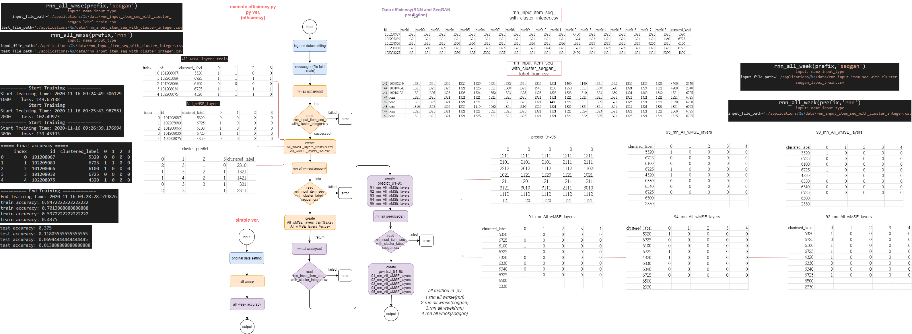</center>


## Step 4 :  Prediction accuracy: Compare the accuracy of sequence prediction with RNN and HiSeqGAN

<center>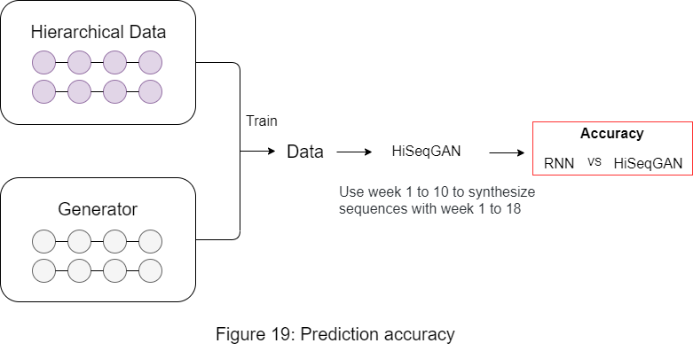</center>

- Execute the following command to compare the accuracy of sequence prediction by RNN, HiSeqGAN.
  - __data__ : Set the data name which map the ***.csv*** file in raw-data folder.
  - __index__ : Set the field as the index for clustering.
  - __target__ : Set the field as the index for clustering.
  - __generated_num__ : The number that how many sequences are generated.
  - __total_batch__ : Number of times the entire dataset was trained.
  - __batch_size__ : The batch size will determine the number of samples we train at a time.
```bash
python execute-seqgan.py --data=wm5-normalize --target=id --generated_num=55 --total_batch=100 --batch_size=5 --seq_length=18
```

- There has the same setting as the previous experiment but this time it has to use its prediction to predict the next periods. For our HiSeqGAN model, we use $`Data{_{raw}}`$ with week 1 to 10 to synthesize 9856 sequences with week 1 to 18 (denoted as the set $`S`$). Then for each item ($`Y^{item}`$), we use the following algorithm to find a synthesized sequence Y that has its prefix best match to $`Y^{item}`$ and then use the postfix (clusters on week 2 to 18) of the selected synthesized sequence for prediction.

```math
\max_{Y\in S}{\tt SequenceSimilarity}(Y_{1:t},Y^{item})
```
<center>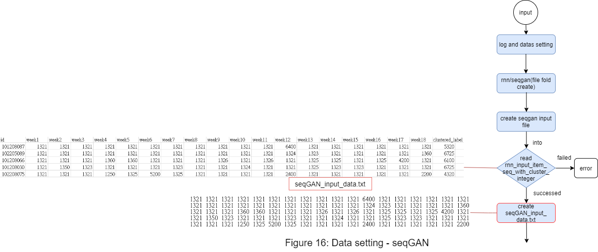</center>
<center></center>
<center>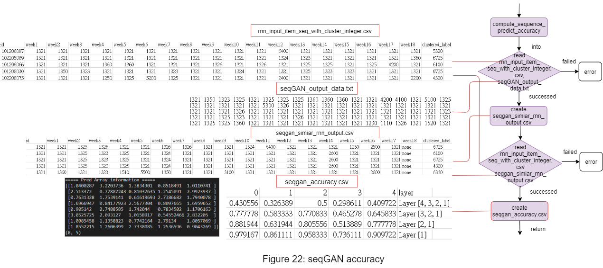</center>
<center>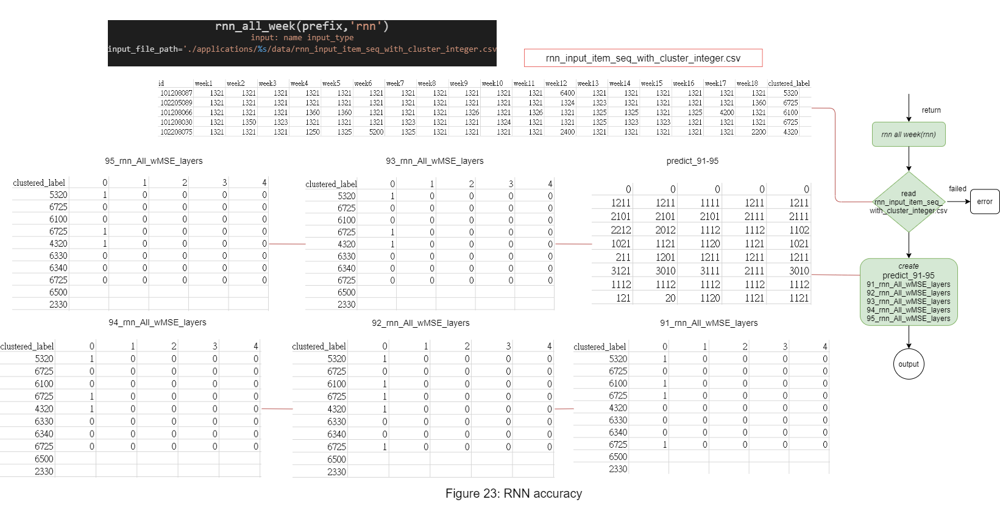</center>


## Step 5 : Concretization: From Cluster Prediction to Actual Value Prediction
- The previous steps show how the abstract domain data can be constructed and predicted. In the last step, we show how to concretize the abstract domain data back to the actual values. This is done by mapping the cluster to the high dimensional values that can be clustered into the cluster. When we find the predicted cluster, we will use the average and standard deviation of the original cluster to simulate the original value and compare it with the real value.

- - -
<center>Copy 2019 &copy; Mindy Hsu. All rights reserved</center>
