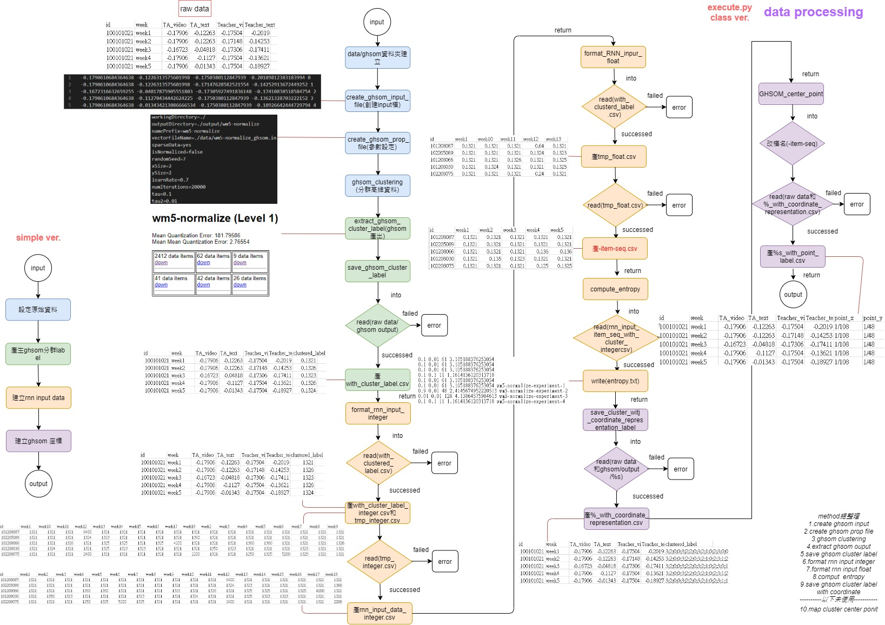
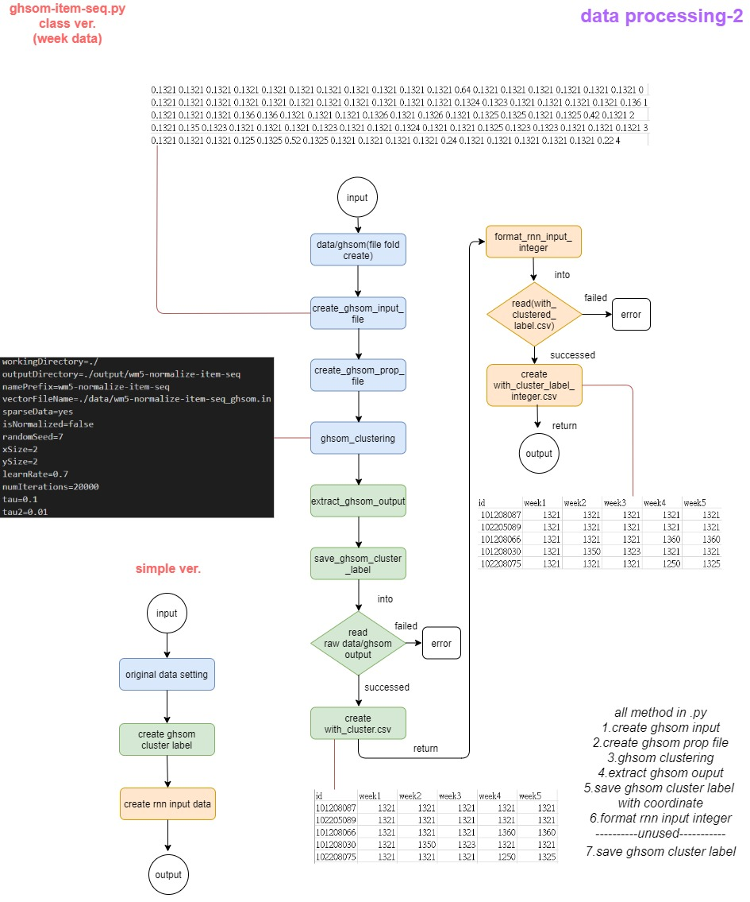
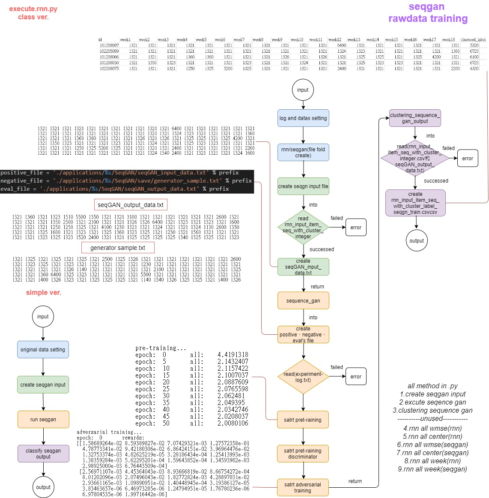
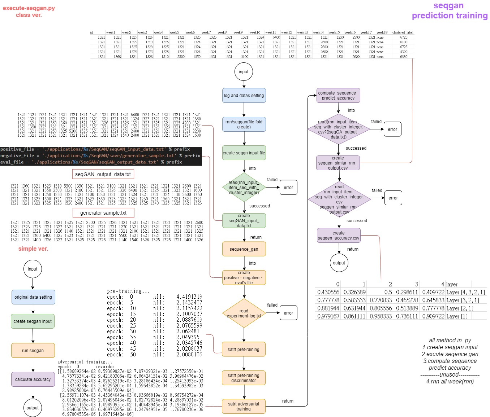

# HiSeqGAN : Hierarchical Sequence Synthesis and Prediction
- Author : Yun-Chieh Tien (106356004@nccu.edu.tw), Chen-Min Hsu (107356019@nccu.edu.tw), and Fang Yu (yuf@nccu.edu.tw)

## Abstract
High-dimensional data sequences constantly appear in practice. State-of-the-art models such as recurrent neural networks suffer prediction accuracy from complex relations among values of attributes. Adopting unsupervised clustering that clusters data based on their attribute value similarity results data in lower dimensions that can be structured in a hierarchical relation. It is essential to consider these data relations to improve the performance of training models. In this work, we propose a new approach to synthesize and predict sequences of data that are structured in a hierarchy.

## GHSOM & Hierarchical data encoding
GHSOM is a self-organizing map that grows hierarchically based on data distribution. The GHSOM map results data in clusters of a tree-like structure. Use decimal encoding to label the clusters. After using the decimal number to label clusters, we converse each number to the two-dimensional coordinate vector show as Fig.1.

<center></center>

## HiSeqGAN
HiSeqGAN uses the real-world data and the native samples generated by the generator to train the discriminator, so that the discriminator can distinguish real-world data from fake samples. Then, the reward is passed back to the intermediate state-action steps by using the Monte Carlo search. Second, the generator updates by reinforcement learning . HiSeqGAN framework show as Fig.2.

<center></center>

## Sequence Similarity
To evaluate the prediction on clusters between two labels, we propose three-dimensional cosine similarity on their coordinates. The reason that we extend two-dimensional to three-dimensional is to prevent the distortion of the original point on the same plane.

<center></center>

## Experiments
<center></center>

In the experiment we are divided into four parts
- _Data Preprocessing_
  - Use GHSOM to transform data from high-dimensional data into hierarchical data
  - Generate the cluster sequence base on item
- _Use HiSeqGAN to generate sequence data and perform sequence synthesis, and use RNN to compare the accuracy of the original data with the sequence synthesis data in sequence prediction_
- _Compare the accuracy of Naive Bayes, RNN, HiSeqGAN for time series data prediction_
- _From cluster prediction to actual value prediction_
### Prerequisites
Please download this repository and put the data in `./raw/data` folder. 

### Step 1 : Data Preprocessing
- Execute the following command to transform data from high-dimensional data into hierarchical data. And label each cluster according to its position in each layer. Then generate cluster seqence base on `$index` and `$date_column`.
  - __tau1__ : Which represents the same-layer SOM map similarity.
  - __tau2__ : The depth of the GHSOM structure.
  - __data__ : Set the data name which map the ***.csv*** file in raw-data folder.
  - __index__ : Set the field as the index for clustering.
  - __target__ : Set the field as the index for clustering.
  - __date_column__ : Fields sorted by time, which use this column to generate a cluster sequence.
  - __train_column__ : Field to be clustering.
```bash
python execute.py --tau1=0.1 --tau2=0.01 --data=wm5-normalize --index=id --target=id --date_column=week --train_column=TA_video,TA_text,Teacher_video,Teacher_text
```

#### Use GHSOM to transform data from high-dimensional data into hierarchical data
Here we use the [GHSOM](http://www.ifs.tuwien.ac.at/~andi/ghsom/) program provided by Vienna University of Technology. 

When you have executed the above instructions, you will do the following, and generate data in `applications/$data/` folder.

- Before converting high-dimensional data into hierarchical data, please convert the data into a specific format (.in file). ex. [wpg_ghsom.in](./program/GHSOM/data/wpg_ghsom.in) 

- The .in file format is as follows :
    ```bash
    $TYPE inputvec
    $XDIM 2592
    $YDIM 1
    $VECDIM 4

    -0.1790610684364638 -0.1226313575601998 -0.1750380112847939 -0.20189812383183994 0
    -0.1790610684364638 -0.1226313575601998 -0.17147628582521554 -0.14252913672449252 1
    -0.1672316632659255 -0.04817875905551803 -0.17305927491836148 -0.17410838518584754 2
    -0.1790610684364638 -0.11270434442624225 -0.1750380112847939 -0.13621328703222152 3
    -0.1790610684364638 -0.013434213086666534 -0.1750380112847939 -0.18926642444729794 4
    -0.16469679072938154 -0.1226313575601998 -0.17187203309850205 -0.03958078674047519 5
    -0.1790610684364638 -0.06182840211470969 -0.1750380112847939 -0.17221363027816625 6
    -0.1790610684364638 -0.1226313575601998 -0.1750380112847939 -0.17284521524739332 7
    -0.1790610684364638 -0.0568648955477309 -0.1750380112847939 -0.17726631003198304 8
    -0.1790610684364638 -0.08044155174088014 -0.1750380112847939 -0.17095046033971206 9
    -0.1790610684364638 -0.07175541524866726 -0.1750380112847939 -0.17473997015507464 10
    ....
    ```
  > Reference from : http://www.ifs.tuwien.ac.at/~andi/somlib/download/SOMLib_Datafiles.html#input_vectors
  
- Then GHSOM property file is generated as follows : 
    ```bash
    workingDirectory=./
    outputDirectory=./output/wm5-normalize
    namePrefix=wm5-normalize
    vectorFileName=./data/wm5-normalize_ghsom.in
    sparseData=yes
    isNormalized=false
    randomSeed=7
    xSize=2
    ySize=2
    learnRate=0.7
    numIterations=20000
    tau=0.1
    tau2=0.01
    ```
  > Reference from : http://www.ifs.tuwien.ac.at/dm/somtoolbox/examples/PROPERTIES

- When GHSOM finished clustering, it will generate the output in `applications/$data/GHSOM/output/$data` folder. It contains  `.html`, `.map`, `.unit`, `.wgt`. 
  - The `.unit` file describes the units of the trained Self-Organizing Map. It is written by the SOM training program.<br>
    - The files consists of two blocks, the first one describing the general SOM structure, the second giving a specific description of every unit.
    - The first 3 parameter entries are given as a sanity check to find out whether the given SOM map file and weight vector file match. If any of the 3 first parameters does not match the program should print a detailed error message and exit.
  > Reference from http://www.ifs.tuwien.ac.at/~andi/somlib/download/SOMLib_Datafiles.html
  
<center></center>

#### Generate the cluster sequence base on item

- We will generate the cluster sequence based on the fields given by `$index` and `$date_column`.
```csv
id,week1,week2,week3,week4,week5,week6,week7,week8,week9,week10,week11,week12,week13,week14,week15,week16,week17,week18
102205089,5521,5521,5521,5521,5521,5521,5521,5521,5521,5521,5521,5524,5521,5521,5521,5521,5521,5560
```
<center></center>

### Step 2 : Use SeqGAN generate sequence for sequence synthesis
Use RNN to compare the accuracy of sequence prediction between the original data and the data for sequence synthesis. Please refer to this [paper]((https://arxiv.org/abs/1609.05473)) for the principle of [SeqGAN](https://github.com/LantaoYu/SeqGAN).

In this experiment, we will use time series data of length 96
$`Data{_{raw}}`$ generate sequence data of the same length. This data is merged into the original data to become $`Data{_{HiSeqGAN}}`$, and compared with $`Data{_{raw}}`$ to verify whether adding SeqGAN data can improve the accuracy of time series prediction of RNN.

- Execute the following command to generate sequence for sequence synthesis and use RNN to compare the accuracy of sequence prediction between the original data and the data for sequence synthesis.
  - __data__ : Set the data name which map the ***.csv*** file in raw-data folder.
  - __index__ : Set the field as the index for clustering.
  - __target__ : Set the field as the index for clustering.
  - __generated_num__ : The number that how many sequences are generated.
  - __total_batch__ : Number of times the entire dataset was trained.
  - __batch_size__ : The batch size will determine the number of samples we train at a time.
```bash
python execute-rnn.py --data=wm5-normalize --target=id --generated_num=55 --total_batch=100 --batch_size=5 --seq_length=18
```

- First we use SeqGAN to generate data $`Data{_{HiSeqGAN}}`$. There are 5712 original data, so here we use SeqGAN to generate 960 time series data.
After SeqGAN has generated the data, we will add them to original data to verify adding SeqGAN data can improve the accuracy of time series prediction of RNN.

<center></center>

### Step 3 :  Compare the accuracy of sequence prediction by RNN, HiSeqGAN
- Execute the following command to compare the accuracy of sequence prediction by RNN, HiSeqGAN.
  - __data__ : Set the data name which map the ***.csv*** file in raw-data folder.
  - __index__ : Set the field as the index for clustering.
  - __target__ : Set the field as the index for clustering.
  - __generated_num__ : The number that how many sequences are generated.
  - __total_batch__ : Number of times the entire dataset was trained.
  - __batch_size__ : The batch size will determine the number of samples we train at a time.
```bash
python execute-seqgan.py --data=wm5-normalize --target=id --generated_num=55 --total_batch=100 --batch_size=5 --seq_length=18
```

The RNN has the same setting as the previous experiment but this time it has to use its prediction to predict next periods.For our HiSeqGAN model, we use $`Data{_{raw}}`$ with week 1 to 10 to synthesize ***n*** sequences with week 1 to 18 (denoted as the set $`S`$). Then for each item ($`Y^{item}`$), we use following algorithm to find a synthesized sequence Y that has its prefix best match to $`Y^{item}`$, and then use the postfix (clusters on week 2 to 18) of the selected synthesized sequence for prediction.

```math
\max_{Y\in S}{\tt SequenceSimilarity}(Y_{1:t},Y^{item})
```

<center></center>

### Step 4 : From Cluster Prediction to Actual Value Prediction
When we find the predicted cluster, we will use the average and standard deviation of the original cluster to simulate the original value and compare it with the real value.

```bash
python draw_ratio_chart.py
```

## Use cases
- Supply chain demand forecasting
- Predict final grades base on students' learning situation
- Use credit rating data to predict whether customers will bounce

## Contributions
- Input generation: provide more data to train a  model such as RNN
- Sequence prediction: achieve higher accuracy for predicting high dimensional data sequence


- - -
<center>Copy 2019 &copy; Mindy Hsu. All rights reserved</center>
